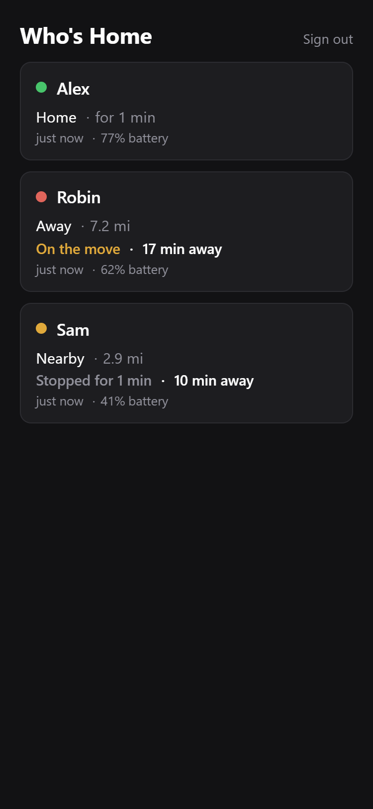
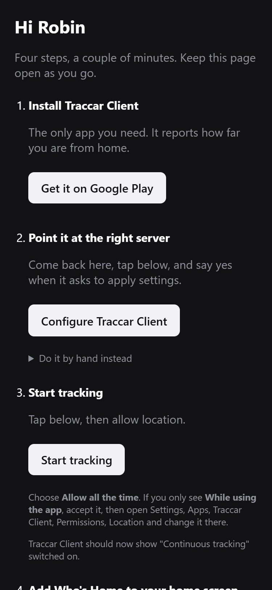
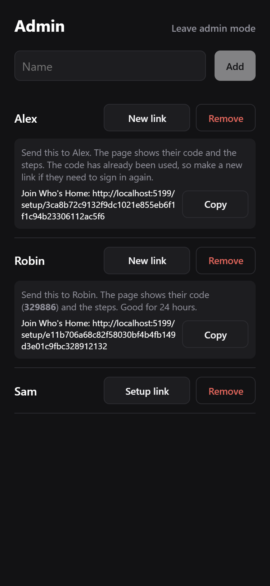

# Who's Home

A household presence board. It shows who is home, who is nearby, and who is away, without
showing anyone's actual location.

Household members install exactly one app: [Traccar Client](https://www.traccar.org/client/),
which is published on both stores and reports to this server over the OsmAnd protocol. The
viewer is a web app that installs to the home screen, so there is no second app and nothing
to publish.

## Design

The server computes distance from home when a report arrives and stores that. Only one raw
coordinate pair exists per person, on the person row, overwritten on every report, so the database
never accumulates a location history. It is kept because routing needs an origin to measure from.
The read API returns distances, states and durations, and no coordinates.

The last known state is always shown, however old it is. Traccar Client stops reporting when a
phone is stationary, does not resume after a reboot, and can be silently disabled by an app
update, so a report older than `StaleAfter` is flagged with `isStale` and its age for the UI to
present as history rather than as current fact. Only a person who has never reported at all
reads as `Unknown`.

Each card also shows how long that person has been in one spot. Movement is measured against the
previous fix rather than against home, so driving in a circle still counts as moving, and
`MovementThresholdMeters` sits above the GPS noise floor so a stationary phone does not appear to
wander. Time in one place is suppressed while moving, and while stale.

The UI is dark only, and does not follow the system theme.

## Layout

`WhosHome.Server` is an ASP.NET Core app: the OsmAnd receiver, the read API, session auth, push
notifications and routing. `WhosHome.Web` is a Vite + Svelte + TypeScript app that compiles to
static files. In production ASP.NET Core serves those files from `wwwroot` on the same origin as
the API, so there is no CORS to configure and no Node at runtime.

## Running locally

Two servers side by side. The .NET one:

```bash
dotnet run --project WhosHome.Server --urls http://localhost:5199
```

And the frontend, which proxies `/api` and `/ingest` across to it:

```bash
npm run dev --prefix WhosHome.Web
```

Open the Vite URL, not the .NET one. The development profile writes to `./.localdb/whoshome.db`
and sets the admin token to `dev-token`. Home coordinates have no sensible default, so set them
or everyone reads as thousands of miles away; the server logs a warning when they are missing,
and logs the effective radii and routing target on every start.

Add a person, which returns the generated `deviceId` used as the ingest credential:

```bash
curl -X POST http://localhost:5199/api/people -H "Content-Type: application/json" -H "X-WhosHome-Admin-Token: dev-token" -d "{\"name\":\"Micah\"}"
```

Simulate a report:

```bash
curl "http://localhost:5199/ingest?id=<deviceId>&lat=42.5876&lon=-71.8140"
```

Mint a sign-in code and a setup link for that person:

```bash
curl -X POST http://localhost:5199/api/people/1/code -H "X-WhosHome-Admin-Token: dev-token"
```

If `wwwroot` is deleted after a build, `dotnet run` and `dotnet ef` both fail with a
`DirectoryNotFoundException`: the static web assets manifest in `bin` still references it. Rebuild
the frontend, or clean `obj` and `bin`.

## Configuration

All settings live under the `WhosHome` section and can be overridden with environment variables
using the `WhosHome__` prefix. Blank values are treated as unset and fall back to the defaults
below, so container templates can leave optional fields empty. Defaults are defined in C# only.
Adding them to `appsettings.json` would silently override the values below.

| Setting | Default | Notes |
| --- | --- | --- |
| `HomeLatitude` / `HomeLongitude` | unset | Required. Everything is measured from here |
| `HomeRadiusMeters` | 150 | Below about 150 m this flaps, since the client's distance filter is 75 m |
| `NearbyRadiusMeters` | 8047 | Five miles. Also the ring that triggers a "getting close" notification |
| `MovementThresholdMeters` | 200 | Above the roughly 100 m GPS noise floor, so a parked phone reads as still |
| `StaleAfter` | 45 min | Older than this is flagged stale; the state is still shown |
| `ReportRetention` | 30 d | How long derived reports survive |
| `DatabasePath` | `/data/whoshome.db` | Must be a mounted volume in the container |
| `AdminToken` | unset | Admin is disabled entirely when unset |
| `SignInCodeLifetime` | 24 h | Codes are single use regardless |
| `MemberSessionLifetime` | 365 d | Sliding, so regular use never requires signing in again |
| `AdminSessionLifetime` | 30 d | Sliding |
| `SignInAttemptsPerMinute` | 10 | Per client, across both member and admin sign-in |
| `VapidSubject` | `mailto:admin@localhost` | Contact address push services see |
| `OsrmBaseUrl` | unset | Set to enable travel times. Blank shows distance only |
| `OsrmMaxSnapMeters` | 250 | How far a coordinate may snap to a road before the route is discarded |
| `OsrmTimeout` | 2 s | Runs inline with an incoming report |
| `OsrmFailureCooldown` | 5 min | Must exceed the report interval or every report pays the timeout |

## Authentication

Three separate credentials, none of which is a password.

**Device id** is the ingest credential. Long, random, and never typed by a human: the setup page
hands it to Traccar Client through a deep link.

**Sign-in codes** are six digits, single use, rate limited, and valid for `SignInCodeLifetime`.
They must be typed inside the installed app rather than in a browser tab.

**Admin mode** is a role a browser enters by presenting the admin token, not an attribute of a
person, so the machine used for provisioning never has to exist on the board. Admin can also read
the board. The token is the way back in when no browser holds admin mode.

Sessions are cookie based with sliding expiry. The Data Protection keys that sign them are
written next to the database, so a container update does not sign the household out.

## Notifications

Web push, delivered to the service worker. The VAPID keypair is generated on first run and stored
next to the database. Do not lose it: subscriptions are tied to the public key, so replacing it
forces everyone to re-enable notifications.

Announcements fire on state changes only, never on the repeated reports that arrive while someone
sits still:

| Transition | Push |
| --- | --- |
| Away to Nearby | "X is nearby" |
| Nearby or Away to Home | "X is home" |
| Home to anything | "X left" |
| Nearby to Away | "X is away" |
| Unknown to anything | silent, first report |

Each person chooses who they hear about, using the bell on each card. The default is everyone
except yourself, and your own bell can be switched on like any other.

## Routing

Optional. With `OsrmBaseUrl` set, cards show driving time home alongside distance. It is display
only: state and notifications always come from straight-line distance, so a routing failure
degrades to plain distance rather than affecting whether someone counts as home.

OSRM snaps input coordinates to the nearest road in whichever extract it was built from, and
returns `"code":"Ok"` for points far outside it, describing a journey between two arbitrary snapped
positions. A successful status is therefore not enough: a route is only trusted when every
waypoint snapped within `OsrmMaxSnapMeters`, and anything further is discarded.

Routing is skipped when someone is already home. After a failure, routing pauses for
`OsrmFailureCooldown` and resumes on the next report after that.

## Client setup link

Traccar Client accepts configuration over a custom URL scheme. The parameter names are `url` and
`id`, not `serverUrl` and `deviceId`.

```
org.traccar.client://configure?url=<urlencoded server /ingest URL>&id=<deviceId>&accuracy=medium&distance=75&interval=300&stop_detection=true
```

Any host works except `action`, which is reserved. `org.traccar.client://action/start` and
`org.traccar.client://action/stop` toggle tracking with no confirmation dialog. Applying settings
does not start tracking, so both links are needed.

The same parameters work in a QR code. If the scanned URI uses http or https, the client takes
the server URL from the link's own origin and path.

## Endpoints

| Endpoint | Auth | Purpose |
| --- | --- | --- |
| `GET`/`POST` `/ingest` | device id | OsmAnd protocol receiver |
| `GET` `/api/presence` | member or admin | The board |
| `POST` `/api/session` | sign-in code | Start a session |
| `GET` `/api/session` | member | Who am I |
| `DELETE` `/api/session` | none | Sign out |
| `POST` `/api/admin/session` | admin token | Enter admin mode in this browser |
| `GET` `/api/admin/session` | admin | Am I an admin |
| `DELETE` `/api/admin/session` | none | Leave admin mode |
| `GET`/`POST` `/api/people` | admin | List and add household members |
| `DELETE` `/api/people/{id}` | admin | Remove someone; their reports cascade |
| `POST` `/api/people/{id}/code` | admin | Mint a sign-in code and setup link |
| `GET` `/api/setup/{token}` | setup token | What the setup page shows someone |
| `GET` `/api/push/key` | none | Public VAPID key, public by design |
| `POST`/`DELETE` `/api/push/subscribe` | member | Manage this browser's subscription |
| `GET` `/api/notifications` | member | Who I hear about |
| `PUT` `/api/notifications/{id}` | member | Change that |
| `GET` `/health` | none | Liveness |

## Deployment

Built by GitHub Actions to `ghcr.io/micahmo/whoshome:latest` on every push. `unraid/whoshome.xml`
is an Unraid template whose optional fields are blank, so the defaults above apply unless set.

Mount `/data` on real storage. It holds the database, the session signing keys and the VAPID
keypair, so losing it loses history, signs everyone out, and breaks every push subscription.

## Known gaps

Traccar Client reports roughly every 90 seconds regardless of the configured interval, an
[upstream issue](https://github.com/traccar/traccar-client/issues/198). It costs battery and
nothing else.

Tracking does not resume after a phone reboot, and an app update can switch it off. Nothing on the
server can detect the difference between a phone that has stopped reporting and a person who has
not moved, which is why age is shown on every card.

Routing only works inside the region OSRM was built for. Positions outside it are discarded, so
travel time disappears rather than showing a wrong number.

## Screenshots

| The board | Onboarding | Admin |
| :---: | :---: | :---: |
|  |  |  |

The board is what everyone looks at. The setup page is the only thing a new household member is
sent, and it is the whole onboarding flow. The admin page is how people are added and removed, and
it never appears on the board itself.
